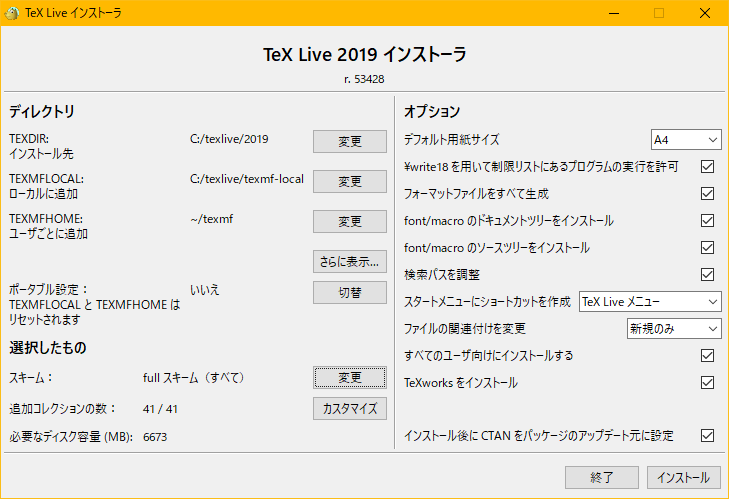

# latex_template

TeX文章の雛形。

## TeX Live

最近流行ってるTeXディストリビューションであるTeX Liveをインストールする。

### インストーラの入手

[TeX Live インストーラ](https://www.tug.org/texlive/acquire-netinstall.html)をダウンロードして起動。

### インストール設定

**TexWorksをインストール**のチェックを外す。
他の設定はそのまま。
（リポジトリは通信速度が早いものが自動的に選ばれる）
（スキーム、コレクションの依存関係に悩まされたくないのですべて入れる）



### インストール開始

10分ほどでインストールは終了する。

### パッケージ管理

Windows版。

TeX Liveにはパッケージ管理ツールがある。
GUIは`tlshell.exe`、CLIは`tlmgr.exe`で起動。
パッケージを追加、更新できる。

コマンド`tlmgr update --self --all`で全パッケージとパッケージ管理ツールをアップデート。

## TeX環境以外の準備

### エディタ準備

**VSCode**とその拡張機能**LaTeX Workshop**を使用。

* * *

## プリアンブル

```latex
\documentclass[autodetect-engine,dvi=dvipdfmx,ja=standard,a4paper]{bxjsarticle}
\usepackage{subfiles}

\usepackage[backend=biber,style=ieee]{biblatex}
\bibliography{src/ref.bib}

\usepackage{graphicx}
\graphicspath{{./fig/}{../fig/}}

\usepackage{mathtools}
\usepackage{newtxtext,newtxmath,helvet}
\usepackage{bm}
\usepackage{hyperref}

\begin{document}
ハローlatex
\texttt{latex}

\cite*{antbook}

\subfile{doc/introduction.tex}

\printbibliography[title=参考文献]

\end{document}
```

### 文章エンジン

コンパイルが速くてUnicode文字が使える`uplatex`を使う。

`uplatex`はコンパイルエラー時に入力を求める。
コンパイルエラー時に入力を求めずに終了するよう変更する。
`uplatex`のオプションに
`-halt-on-error -interaction=nonstopmode -file-line-error`
を追加する。

`uplatex,bibtex,dvipdfmx`などを適切な回数実行してくれる
[latexmk](https://texwiki.texjp.org/?Latexmk)
を使う。
[Latexmk - TeX Wiki](https://texwiki.texjp.org/?Latexmk)
を参考に（コピー&ペースト）して`~/.latexmkrc`を書く。
上記のようにコンパイルエラーを無視するオプションを追加する。
`latexmk`を実行する。

### ドキュメントクラス

`BXjscls`を使う。

```latex
\documentclass[autodetect-engine,dvi=dvipdfmx,ja=standard,a4paper]{bxjsarticle}

```

### 参考文献

```latex
% preamble
\usepackage[backend=biber,style=ieee]{biblatex}
\bibliography{src/ref.bib}

% document内の最後
\printbibliography[title=参考文献]

```

### 数式

数式系の命令を追加する
`amsmath`の修正版の`mathtools`を読み込む。

### フォント

フォントをTimes,Helvetica Likeに変更。
`newtxtext,newtxmath,helvet`パッケージを読み込む。
`newtxtext,newtxmath`は`mathtools`の後に読み込まないと衝突するらしい。

### ベクトル

太字の斜体でベクトルを表現する。
`\bm{a}`命令を使う。
`bm`パッケージを読み込む。

### ハイパーリンク

TeX文章にハイパーリンクを追加する。
[hyperref - TeX](https://texwiki.texjp.org/?hyperref)

### 画像のパス省略

`graphicspath`パッケージを使えば画像フォルダへのパスを省略できる。
`\graphicspath{{./fig/}{../fig/}}`

### ソースコードハイライト

[minted](https://www.overleaf.com/learn/latex/Code_Highlighting_with_minted)を使う。

### ファイル分割

`subfiles`パッケージ。

* `main.tex`のドキュメントクラスの次に`\usepackage{subfiles}`。
* `main.tex`の`\subfile{doc/introduction.tex}`と分割するファイルを読み込む。
* `introduction.tex`ではドキュメントクラスを`\documentclass[../main]{subfiles}`とする。

`main.tex`をコンパイルすると`sub.tex`を統合した文章が出力される。
`sub.tex`をコンパイルすると`sub.tex`のみの文章が出力される。プリアンブルは`main.tex`を参照する。

> main.tex

```latex
\documentclass[autodetect-engine,dvi=dvipdfmx,ja=standard,a4paper]{bxjsarticle}
\usepackage{subfiles}
\begin{document}
\subfile{sub.tex}
\end{document}
```

> sub.tex

```latex
\documentclass[../main]{subfiles}
\begin{document}
introduction
\end{document}
```

* * *

## タイトル

簡単な文章ならば`\maketitle`命令をそのまま使う。
位置指定命令を使いタイトルを作成したり、`\maketitle`命令を改造する。
表紙だけWord等で作るのが楽。

## MarkdownをTeXファイルに変換

予定。

## ディレクトリ構成

次のようにTeX文章のファイルを分割する。

* 🗄️`main.tex`  複数の文章を結合
* 📁`src`  設定フォルダ
  * 🗄️`ref.bib`  参考文献
* 📁`doc`  文章フォルダ
  * 🗄️`introduction.tex`  文章
* 📁`fig`  画像フォルダ
  * 📷`a.png,a.jpg,a.pdf`   画像
